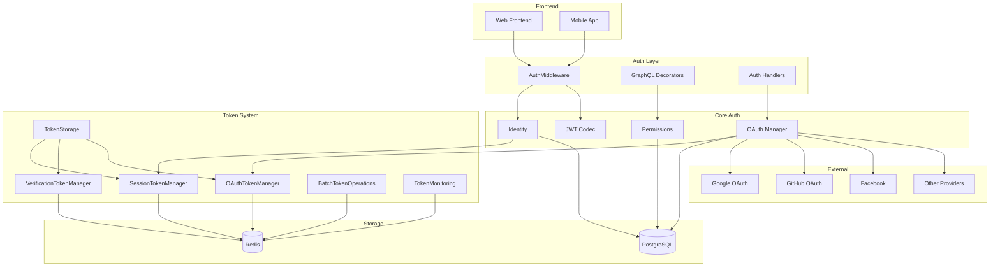
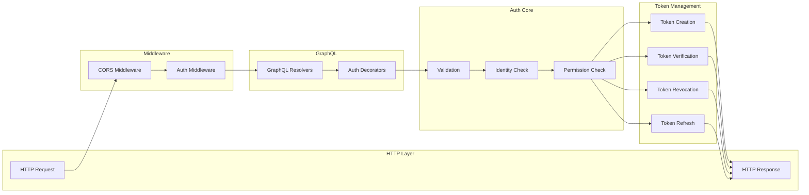
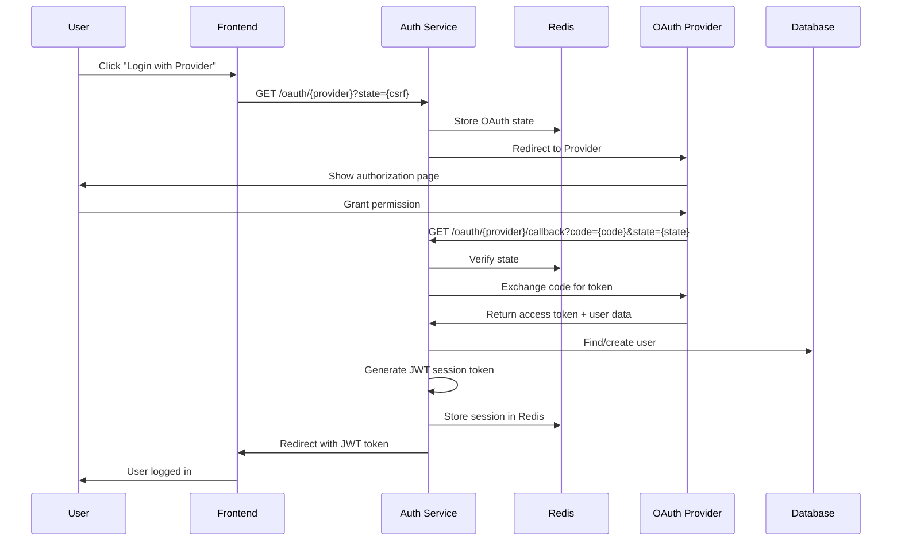
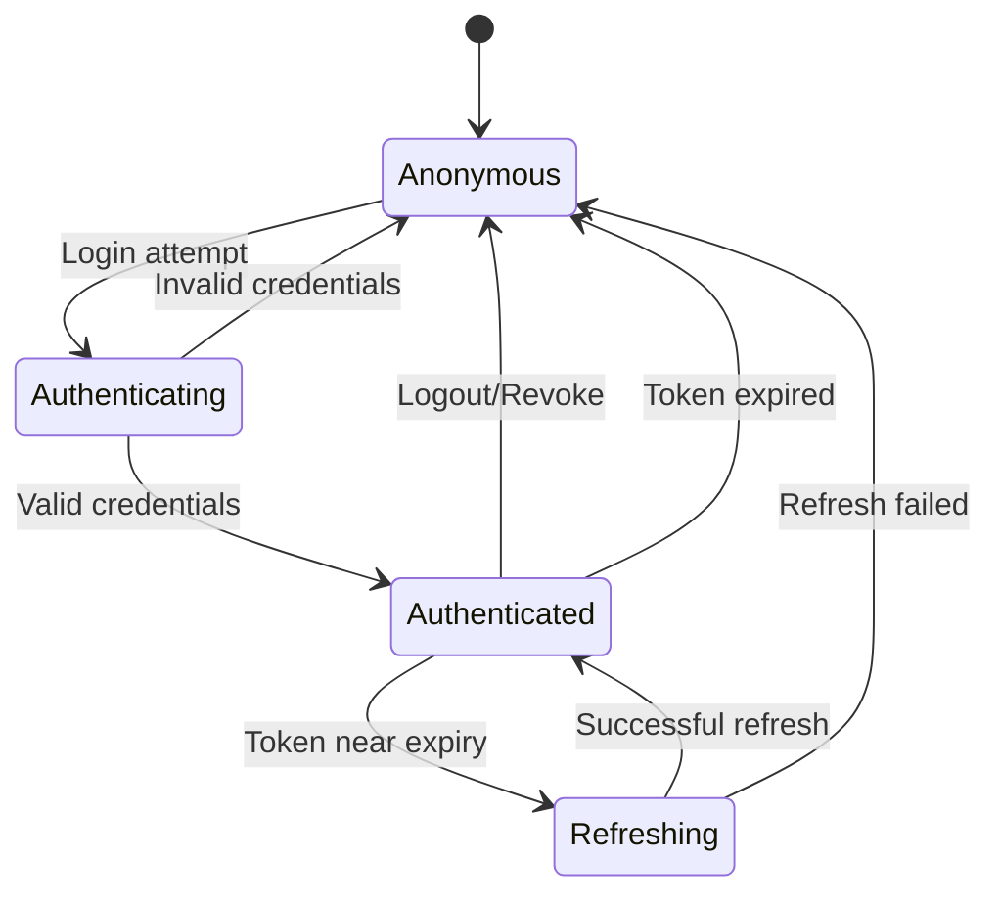
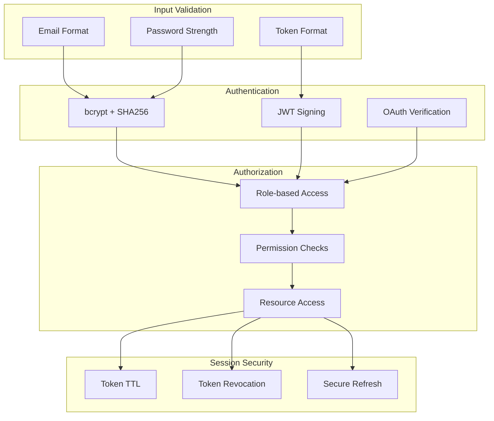

# Архитектура системы авторизации

## Схема потоков данных



## Диаграмма компонентов



## Схема OAuth потока



## Схема сессионного управления



## Redis структура данных

```
├── Sessions
│   ├── session:{user_id}:{token}     → Hash {user_id, username, device_info, last_activity}
│   ├── user_sessions:{user_id}       → Set {token1, token2, ...}
│   └── {user_id}-{username}-{token}  → Hash (legacy format)
│
├── Verification
│   └── verification_token:{token}    → JSON {user_id, type, data, created_at}
│
├── OAuth
│   ├── oauth_access:{user_id}:{provider}   → JSON {token, expires_in, scope}
│   ├── oauth_refresh:{user_id}:{provider}  → JSON {token, provider_data}
│   └── oauth_state:{state}                 → JSON {provider, redirect_uri, code_verifier}
│
└── Monitoring
    └── token_stats                   → Hash {session_count, oauth_count, memory_usage}
```

## Компоненты безопасности



## Масштабирование и производительность

### Горизонтальное масштабирование
- **Stateless JWT** токены
- **Redis Cluster** для высокой доступности
- **Load Balancer** aware session management

### Оптимизации
- **Connection pooling** для Redis
- **Batch operations** для массовых операций
- **Pipeline использование** для атомарности
- **LRU кэширование** для часто используемых данных

### Мониторинг производительности
- **Response time** auth операций
- **Redis memory usage** и hit rate
- **Token creation/validation** rate
- **OAuth provider** response times
